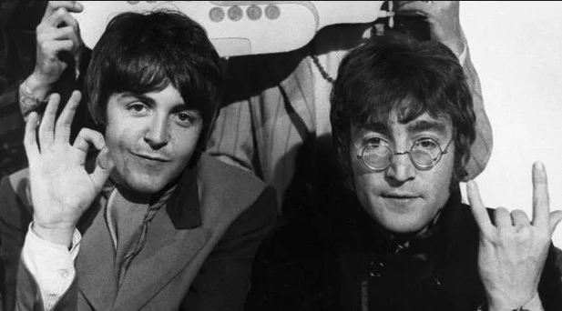
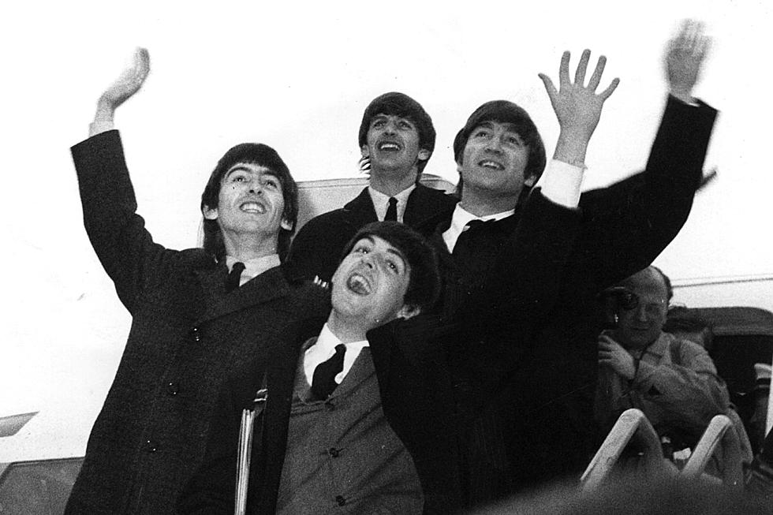

```{r setup, include=FALSE}
knitr::opts_chunk$set(echo = TRUE)
```

```{r include=FALSE}
library(tidyverse)
library(spotifyr)
library(plotly)
# Color Palettes
library(wesanderson)
library(compmus)
library(shiny)
library(gridExtra)
library(ggridges)
library(tidymodels)
library(ggdendro)
library(heatmaply)
```

```{r include=FALSE}
get_conf_mat <- function(fit) {
  outcome <- .get_tune_outcome_names(fit)
  fit %>% 
    collect_predictions() %>% 
    conf_mat(truth = outcome, estimate = .pred_class)
}  

get_pr <- function(fit) {
  fit %>% 
    conf_mat_resampled() %>% 
    group_by(Prediction) %>% mutate(precision = Freq / sum(Freq)) %>% 
    group_by(Truth) %>% mutate(recall = Freq / sum(Freq)) %>% 
    ungroup() %>% filter(Prediction == Truth) %>% 
    select(class = Prediction, precision, recall)
}  
```


### Introduction Lennon-McCartney and Corpus

The Lennon-McCartney songwriting partnership was one of the most successful musical cooperations of all time. In the early days of the Beatles, John Lennon and Paul McCartney would often collaborate on songs extensively. As teenagers, they had made an agreement that they would both be credited with all songs written by either of them, whether jointly or separately. This is why all Beatles songs written by either Lennon or McCartney are officially credited to "Lennon-McCartney". Later on it became increasingly common for them to write songs separately. 

In an interview for Playboy Magazine in 1980, Lennon said the following about his songwriting partnership with McCartney:

> [Paul] provided a lightness, an optimism, while I would always go for the sadness, the discords, the bluesy notes. There was a period when I thought I didn't write melodies, that Paul wrote those and I just wrote straight, shouting rock 'n' roll. But, of course, when I think of some of my own songs—"In My Life", or some of the early stuff, "This Boy"—I was writing melody with the best of them.
  
I would be curious to see whether Lennon's characterization of the differences between his and McCartney's songwriting styles is accurate. The spotify API provides some features by which this potential difference could be explored. For example, the *valence* and *energy* features of the AudioFeaturesObject could be useful.

For this course, I will compare Beatles songs written (predominantly) by Paul McCartney to those written (predominantly) by John Lennon. To this end I created two playlists on Spotify. One playlist for the McCartney songs and one for the Lennon songs. I used the [this](http://www.myrsten.nu/worldnet/beatlesongs.htm) webpage as a guide to determine which song was written by whom. The corpus contains 142 songs in total (70 written by Paul McCartney and 72 written by John Lennon).

Paul McCartney once said about his songwriting relationship with John Lennon:

> He’d write ‘Strawberry Fields,’ I’d go away and write ‘Penny Lane’ … to compete with each other. But it was very friendly competition.

This seems to imply that the two songwriters influenced each other's writing to an extent. Therefore, I expect that the songs they wrote seperately during their time in the Beatles are probably more similar than the songs they wrote for their solo albums. To investigate this hypothesis, I will also use the first 2 solo albums by each artist to compare the differences in their early solo work to the differences in their writing styles when they were both in The Beatles.

First solo albums:

Paul McCartney:

- McCartney (1970)

- Ram (1971)

John Lennon:

- Plastic Ono Band (1970)

- Imagine (1971)

***



<div class="tenor-gif-embed" data-postid="4494672" data-share-method="host" data-width="100%" data-aspect-ratio="0.9066666666666666"><a href="https://tenor.com/view/adios-despedida-spanish-beatles-musica-gif-4494672">Los Beatles Se Despiden GIF</a> from <a href="https://tenor.com/search/adios-gifs">Adios GIFs</a></div><script type="text/javascript" async src="https://tenor.com/embed.js"></script>


```{r echo = FALSE}
john_songs <- get_playlist_audio_features("", "6Wxl8tFi8QruTJ8ERPFkFc")
paul_songs <- get_playlist_audio_features("", "64vy4b9yg9tcvrf0a3XvdF")

george_songs <- get_playlist_audio_features("", "4DPiVpe75MnJkwNH31CBay")
ringo_songs <- get_playlist_audio_features("", "6Zhk7J5Ptorytp5HoFXNOc")

# First 3 non-beatles albums
paul_solo <- get_playlist_audio_features("", "6t8llLJqn3SZfMjbGCkK7K")
john_solo <- get_playlist_audio_features("", "1uqxGmA1qQNW7cWV4Tg49E")
george_solo <- get_playlist_audio_features("", "5mZmeueIrx62psQA24DUFG")

```

```{r echo = FALSE}
all_songs <- 
  bind_rows(
    john_songs %>% mutate(category = "John"),
    paul_songs %>% mutate(category = "Paul"),
    #george_songs %>% mutate(category = "George"),
    #ringo_songs %>% mutate(category = "Ringo")
  )

all_songs_george <- 
  bind_rows(
    john_songs %>% mutate(category = "John"),
    paul_songs %>% mutate(category = "Paul"),
    george_songs %>% mutate(category = "George"),
  )

all_solo <-
  bind_rows(
    paul_solo %>% mutate(category = "Paul"),
    john_solo %>% mutate(category = "John"),
    #george_solo %>% mutate(category = "George")
  )

all <- 
  bind_rows(
    all_songs %>% mutate(solo_or_beatles = "The Beatles"),
    all_solo %>% mutate(solo_or_beatles= "Solo"),
  )
  
colors = c("#439AC8", "#F8D348")
```


### Valence VS Energy Beatles

```{r echo = FALSE}
ggplot_var <- ggplot(data = all_songs, mapping = aes(x = valence, y = energy, color = category)) + 
  geom_point(aes(size = track.duration_ms / 60, alpha = loudness, label = track.name)) +
  theme_light() + 
  geom_rug(size = 0.1) +   # Add 'fringes' to show data distribution.
  #scale_color_manual(values=colors) + 
  scale_size(range = c(-2, 6)) + 
  theme(legend.position="none") +
  labs(                            # Make the titles nice.
    x = "Valence",
    y = "Energy") +

  scale_x_continuous(              # Fine-tune the x axis.
    limits = c(0, 1),
    breaks = c(0, 0.50, 1),        # Use grid-lines for quadrants only.
    minor_breaks = NULL            # Remove 'minor' grid-lines.
  ) +
  scale_y_continuous(              # Fine-tune the y axis in the same way.
    limits = c(0, 1),
    breaks = c(0, 0.50, 1),
    minor_breaks = NULL
  ) +
  
  geom_text(                  # Add text labels from above.
    aes(
      x = valence,
      y = energy,
      label = label
    ),
    data = 
      tibble(
        label = c("Tomorrow Never Knows", "Back In The U.S.S.R."),
        category = c("John", "Paul"),
        valence = c(0.0534, 0.494),
        energy = c(0.8290, 0.969)
      ),
    colour = "black",         # Override colour (not mode here).
    size = 2.5,              # Override size (not loudness here).
    hjust = "left",           # Align left side of label with the point.
    vjust = "bottom",         # Align bottom of label with the point.
    nudge_y = 0.03,         # Nudge the label slightly up.
    nudge_x = 0.05
  )

ggplotly(ggplot_var)

#ADD AVERAGE ON GRApH TO COMPARE! ADD THE THING ABOUT IRONIC
```

***

* The differences between the two Beatles' songwriting styles seems to be very small, at least in terms of valence and energy.
* The lowest valence songs are all written by John.
* Maybe the songwriting styles are similar because of the influence they had on each other. The friendly competition, as described in the introduction, may have been, in part, responsible for the distinctive "Beatles Sound".
* It does seem like almost all of the lowest energy songs were written by Paul, except for Julia, the lowest energy song in the entire dataset, which was written by John.
* I labelled two outliers in the dataset: *Tomorrow Never Knows* by John has a very low valence, and *Back In The USSR* has very high energy.


### Valence vs Energy Solo

```{r echo = FALSE}

viz1 <- ggplot(data = all_solo, mapping = aes(x = valence, y = energy, color = category)) + 
  geom_point(aes(size = track.duration_ms / 60, alpha = loudness, label = track.name)) +
  theme_light() + 
  geom_rug(size = 0.1) +
  theme(legend.position="none") +
  #scale_color_manual(values=colors) + 
  scale_size(range = c(-2, 6)) +
  #theme(legend.position="none")
  labs(                            # Make the titles nice.
    x = "Valence",
    y = "Energy") +

  scale_x_continuous(              # Fine-tune the x axis.
    limits = c(0, 1),
    breaks = c(0, 0.50, 1),        # Use grid-lines for quadrants only.
    minor_breaks = NULL            # Remove 'minor' grid-lines.
  ) +
  scale_y_continuous(              # Fine-tune the y axis in the same way.
    limits = c(0, 1),
    breaks = c(0, 0.50, 1),
    minor_breaks = NULL
  ) 

viz2 <- ggplot(data = all_solo) + 
  geom_point(mapping = aes(x = danceability, y = acousticness, color = category, size = track.duration_ms / 60, alpha = loudness, label = track.name)) +
  theme_classic() + 
  geom_rug() +
  #scale_color_manual(values=wes_palette(n=4, name="GrandBudapest1")) + 
  scale_size(range = c(-2, 6)) 
  #theme(legend.position="none")

ggplotly(viz1)
```

***

* We see more of a distinction in the solo albums.
* John's songs noticeably have lower valence than Paul's, on average.
* John has many songs that are not very loud and have low valence and energy. As if he was taking a step back from the high energy, high valence Beatles sound. There appears to be a cluster of low energy, low valence songs by John Lennon.
* The songs on Paul McCartney's first two solo albums are relatively high valence and high energy compared to John's first two solo albums.
* We can conclude that Lennon and McCartney's songwriting styles started to become more different after the Beatles broke up.

### Tempo histograms

```{r echo = FALSE}
plot1 <- ggplot(data = all, mapping = aes(x = tempo)) + 
  geom_histogram(aes(fill = category), position="dodge") +
  theme_light() +
  theme(legend.position="none") +
  facet_wrap(~ solo_or_beatles, nrow = 2)

plot2 <- ggplot(data = all, mapping = aes(x = tempo, color = category)) + 
  geom_density(alpha=0) +
  theme_light() +
  facet_wrap(~ solo_or_beatles, nrow = 2)

grid.arrange(plot1, plot2, nrow = 1)

```

***

* The tempo distributions of Paul and John look quite similar in Beatles songs.
* The slowest Beatles songs were written by John and the fastest by Paul.
* The difference is a bit larger in their solo work. Paul McCartney has slower songs, on average.


### Valence Of Beatles Albums Over Time

```{r echo = FALSE}
album_order <- rev(c("Please Please Me (Remastered)", "With The Beatles (Remastered)", "A Hard Day's Night (Remastered)", "Beatles For Sale (Remastered)", "Help! (Remastered)", "Rubber Soul (Remastered)", "Revolver (Remastered)", "Sgt. Pepper's Lonely Hearts Club Band (Remastered)", "Sgt. Pepper's Lonely Hearts Club Band (Super Deluxe Edition)", "Magical Mystery Tour (Remastered)", "The Beatles (Remastered)", "Yellow Submarine (Remastered)", "Abbey Road (Remastered)", "Let It Be (Remastered)"))
data1 <- filter(all_songs, track.album.release_date < 1973)

plot1 <- ggplot(data = data1, aes(x = valence, y = factor(track.album.name, level = album_order), fill =..x..)) + 
  geom_density_ridges_gradient(size = 0.1) + 
  scale_fill_gradient(low = "blue", high = "orange") + 
  theme_ridges() + 
  theme(panel.background = element_rect(fill = "white")) +
  theme(plot.background = element_rect(fill = "white")) +
  theme(legend.position = "none") +
  theme(axis.title.y = element_blank()) + 
  theme(axis.text.y = element_text(size=5))+
  labs(x = "Valence")
  #+ theme(axis.text.y=element_blank())


plot1


```

***

* Early Beatles albums have higher valence than later Beatles albums.

### Valence Beatles Albums John vs Paul

```{r echo=FALSE}
plot2 <- ggplot(data = data1, aes(x = valence, y = factor(track.album.name, level = album_order), fill =category)) + 
  geom_density_ridges(alpha = 0.9, size = 0.1) + 
  #scale_fill_manual(values=colors) + 
  #scale_fill_gradient(low = "blue", high = "orange") + 
  theme_ridges() + 
  theme(panel.background = element_rect(fill = "white")) +
  theme(plot.background = element_rect(fill = "white")) +
  #theme(legend.position = "none") +
  theme(axis.title.y = element_blank()) + 
  theme(axis.text.y = element_text(size=5))
  #+ theme(axis.text.y=element_blank())

plot2
```

***

* In most of the early Beatles albums, Paul's songs had lower valence than John's and Paul seems to have more variation in valence.


### Chromagram John Lennon - Tomorrow Never Knows

```{r echo = FALSE}

tomorrow <-
  get_tidy_audio_analysis("00oZhqZIQfL9P5CjOP6JsO") %>%
  select(segments) %>%
  unnest(segments) %>%
  select(start, duration, pitches)
```

```{r echo = FALSE}
tomorrow %>%
  mutate(pitches = map(pitches, compmus_normalise, "euclidean")) %>%
  compmus_gather_chroma() %>% 
  ggplot(
    aes(
      x = start + duration / 2,
      width = duration,
      y = pitch_class,
      fill = value
    )
  ) +
  geom_tile() +
  labs(x = "Time (s)", y = NULL, fill = "Magnitude") +
  theme_minimal() +
  scale_fill_viridis_c()

```

***

<object data="https://open.spotify.com/embed/track/00oZhqZIQfL9P5CjOP6JsO" width="425" height="80" frameborder="0" allowtransparency="true">
    <embed src="https://open.spotify.com/embed/track/00oZhqZIQfL9P5CjOP6JsO" width="425" height="80" frameborder="0" allowtransparency="true"></embed>
</object>


* This is a chromagram of the song **Tomorrow Never Knows**, written primarily by *John Lennon*. The song has an experimental and psychedelic sound. 
* Form: Intro | Verse | Verse | Verse | Instrumental |  
                  | Verse | Verse | Verse | Verse | Outro (fade-out)  
* The song lyrics are based on the book *The Psychedelic Experience: A Manual Based on The Tibetan Book of the Dead*. It was intended as a manual for people seeking spiritual enlightenment by using psychedelic drugs, such as LSD.
* The opening lyrics of the song:    

  Turn off your mind   
  Relax and float downstream    
  It is not dying     
        
  Are based on a line from the book: "Whenever in doubt, turn off your mind, relax, float downstream."

* According to the Spotify API, it is the song with the lowest valence of the entire dataset. 
* When I listen to it I notice that it is quite monotonous. However, I don't think it is necessarily a sad or angry song. 
* The chromagram indeed confirms that this song is quite monotonous: almost all of the sound falls into the C-tone bracket.
* John Lennon only used a single chord in the whole song. This creates a hypnotic sound.

### Chromagram Paul Mccartney - Martha My Dear

```{r echo = FALSE}

obla <-
  get_tidy_audio_analysis("1swmf4hFMJYRNA8Rq9PVaW") %>%
  select(segments) %>%
  unnest(segments) %>%
  select(start, duration, pitches)
```

```{r echo = FALSE}
obla %>%
  mutate(pitches = map(pitches, compmus_normalise, "euclidean")) %>%
  compmus_gather_chroma() %>% 
  ggplot(
    aes(
      x = start + duration / 2,
      width = duration,
      y = pitch_class,
      fill = value
    )
  ) +
  geom_tile() +
  labs(x = "Time (s)", y = NULL, fill = "Magnitude") +
  theme_minimal() +
  scale_fill_viridis_c()

```

***

<object data="https://open.spotify.com/embed/track/1swmf4hFMJYRNA8Rq9PVaW" width="425" height="80" frameborder="0" allowtransparency="true">
    <embed src="https://open.spotify.com/embed/track/1swmf4hFMJYRNA8Rq9PVaW" width="425" height="80" frameborder="0" allowtransparency="true"></embed>
</object>
  
* This is a chromagram of the song "Martha My Dear", written by Paul McCartney.
* Form: Intro | Verse | Bridge | Bridge Extension |  
              | Verse (instrumental) | Bridge |  
              | Verse | Outro (with complete ending)  
* The song has an unusual melodig structure. There is modulation from E-flat major to F major in the bridge.
* We see a lot more melodic variation than in the previous chromagram. 


### What is the structure of 'We Can Work It Out’ (chroma and timbre features)

```{r echo = FALSE}
because <-
  
  
  get_tidy_audio_analysis("7LNiAjyg9P2GKINTtN6Yt8") %>%
  #0aym2LBJBk9DAYuHHutrIl
  compmus_align(bars, segments) %>%
  select(bars) %>%
  unnest(bars) %>%
  mutate(
    pitches =
      map(segments,
        compmus_summarise, pitches,
        method = "acentre", norm = "manhattan"
      )
  ) %>%
  mutate(
    timbre =
      map(segments,
        compmus_summarise, timbre,
        method = "mean"
      )
  )
bind_rows(
  because %>% 
    compmus_self_similarity(pitches, "aitchison") %>% 
    mutate(d = d / max(d), type = "Chroma"),
  because %>% 
    compmus_self_similarity(timbre, "euclidean") %>% 
    mutate(d = d / max(d), type = "Timbre")
) %>%
  mutate() %>% 
  ggplot(
    aes(
      x = xstart + xduration / 2,
      width = xduration,
      y = ystart + yduration / 2,
      height = yduration,
      fill = d
    )
  ) +
  geom_tile() +
  coord_fixed() +
  facet_wrap(~type) +
  scale_fill_viridis_c() +
  theme_minimal() + 
  labs(x = "", y = "")
```

***

<object data="https://open.spotify.com/embed/track/7LNiAjyg9P2GKINTtN6Yt8" width="425" height="80" frameborder="0" allowtransparency="true">
    <embed src="https://open.spotify.com/embed/track/7LNiAjyg9P2GKINTtN6Yt8" width="425" height="80" frameborder="0" allowtransparency="true"></embed>
</object>


* These two self-similarity matrices illustrate pitch and timbre based self similarity in the song "'We Can Work It Out’" written by John Lennon and Paul McCartney together. 
* Form:   Verse | Verse | Bridge |  
        | Verse | Bridge |  
        | Verse | Outro (with complete ending)  
* This song is interesting in this context, because it illustrates the difference between John Lennon and Paul McCartney's songwriting styles very well.
* Most of the song is written by Paul McCartney. It is quite optimistic sounding ("We can work it out."), but the bridge, written by John Lennon sounds more dark and pessimistic (Life is very short, and there's no time...). The difference is stark, both melodically and lyrically.


### Keygram Uncle Albert/Admiral Halsey

```{r echo = FALSE}
circshift <- function(v, n) {
  if (n == 0) v else c(tail(v, n), head(v, -n))
}

#      C     C#    D     Eb    E     F     F#    G     Ab    A     Bb    B
major_chord <-
  c(   1,    0,    0,    0,    1,    0,    0,    1,    0,    0,    0,    0)
minor_chord <-
  c(   1,    0,    0,    1,    0,    0,    0,    1,    0,    0,    0,    0)
seventh_chord <-
  c(   1,    0,    0,    0,    1,    0,    0,    1,    0,    0,    1,    0)

major_key <-
  c(6.35, 2.23, 3.48, 2.33, 4.38, 4.09, 2.52, 5.19, 2.39, 3.66, 2.29, 2.88)
minor_key <-
  c(6.33, 2.68, 3.52, 5.38, 2.60, 3.53, 2.54, 4.75, 3.98, 2.69, 3.34, 3.17)

chord_templates <-
  tribble(
    ~name, ~template,
    "Gb:7", circshift(seventh_chord, 6),
    "Gb:maj", circshift(major_chord, 6),
    "Bb:min", circshift(minor_chord, 10),
    "Db:maj", circshift(major_chord, 1),
    "F:min", circshift(minor_chord, 5),
    "Ab:7", circshift(seventh_chord, 8),
    "Ab:maj", circshift(major_chord, 8),
    "C:min", circshift(minor_chord, 0),
    "Eb:7", circshift(seventh_chord, 3),
    "Eb:maj", circshift(major_chord, 3),
    "G:min", circshift(minor_chord, 7),
    "Bb:7", circshift(seventh_chord, 10),
    "Bb:maj", circshift(major_chord, 10),
    "D:min", circshift(minor_chord, 2),
    "F:7", circshift(seventh_chord, 5),
    "F:maj", circshift(major_chord, 5),
    "A:min", circshift(minor_chord, 9),
    "C:7", circshift(seventh_chord, 0),
    "C:maj", circshift(major_chord, 0),
    "E:min", circshift(minor_chord, 4),
    "G:7", circshift(seventh_chord, 7),
    "G:maj", circshift(major_chord, 7),
    "B:min", circshift(minor_chord, 11),
    "D:7", circshift(seventh_chord, 2),
    "D:maj", circshift(major_chord, 2),
    "F#:min", circshift(minor_chord, 6),
    "A:7", circshift(seventh_chord, 9),
    "A:maj", circshift(major_chord, 9),
    "C#:min", circshift(minor_chord, 1),
    "E:7", circshift(seventh_chord, 4),
    "E:maj", circshift(major_chord, 4),
    "G#:min", circshift(minor_chord, 8),
    "B:7", circshift(seventh_chord, 11),
    "B:maj", circshift(major_chord, 11),
    "D#:min", circshift(minor_chord, 3)
  )

key_templates <-
  tribble(
    ~name, ~template,
    "Gb:maj", circshift(major_key, 6),
    "Bb:min", circshift(minor_key, 10),
    "Db:maj", circshift(major_key, 1),
    "F:min", circshift(minor_key, 5),
    "Ab:maj", circshift(major_key, 8),
    "C:min", circshift(minor_key, 0),
    "Eb:maj", circshift(major_key, 3),
    "G:min", circshift(minor_key, 7),
    "Bb:maj", circshift(major_key, 10),
    "D:min", circshift(minor_key, 2),
    "F:maj", circshift(major_key, 5),
    "A:min", circshift(minor_key, 9),
    "C:maj", circshift(major_key, 0),
    "E:min", circshift(minor_key, 4),
    "G:maj", circshift(major_key, 7),
    "B:min", circshift(minor_key, 11),
    "D:maj", circshift(major_key, 2),
    "F#:min", circshift(minor_key, 6),
    "A:maj", circshift(major_key, 9),
    "C#:min", circshift(minor_key, 1),
    "E:maj", circshift(major_key, 4),
    "G#:min", circshift(minor_key, 8),
    "B:maj", circshift(major_key, 11),
    "D#:min", circshift(minor_key, 3)
  )
```

```{r echo = FALSE}
albert <-
  get_tidy_audio_analysis("5SwgE4wA0P7f6AEz2UQMB2") %>%
  compmus_align(sections, segments) %>%
  select(sections) %>%
  unnest(sections) %>%
  mutate(
    pitches =
      map(segments,
        compmus_summarise, pitches,
        method = "mean", norm = "manhattan"
      )
  )

martha <- get_tidy_audio_analysis("1swmf4hFMJYRNA8Rq9PVaW") %>%
  compmus_align(sections, segments) %>%
  select(sections) %>%
  unnest(sections) %>%
  mutate(
    pitches =
      map(segments,
        compmus_summarise, pitches,
        method = "mean", norm = "manhattan"
      )
  )

```

```{r echo = FALSE}
albert %>% 
  compmus_match_pitch_template(
    key_templates,         # Change to chord_templates if descired
    method = "euclidean",  # Try different distance metrics
    norm = "manhattan"     # Try different norms
  ) %>%
  ggplot(
    aes(x = start + duration / 2, width = duration, y = name, fill = d)
  ) +
  geom_tile() +
  scale_fill_viridis_c(guide = "none") +
  theme_minimal() +
  labs(x = "Time (s)", y = "") 


```


***

<object data="https://open.spotify.com/embed/track/5SwgE4wA0P7f6AEz2UQMB2?si=hLfnKpjMQtyEdDuCQWo-CQ" width="425" height="80" frameborder="0" allowtransparency="true">
    <embed src="https://open.spotify.com/embed/track/5SwgE4wA0P7f6AEz2UQMB2?si=hLfnKpjMQtyEdDuCQWo-CQ" width="425" height="80" frameborder="0" allowtransparency="true"></embed>
</object>


* Uncle Albert/Admiral Halsey is a song by Paul McCartney from his solo album Ram, with a very interesting structure.
* The different sections of the song are clearly visible in the keygram.
* You can see that some parts of the song are repeated several times.


### Tempogram

```{r echo = FALSE}
lucy <- get_tidy_audio_analysis("25yQPHgC35WNnnOUqFhgVR")

lucy %>%
  tempogram(window_size = 8, hop_size = 1, cyclic = TRUE) %>%
  ggplot(aes(x = time, y = bpm, fill = power)) +
  geom_raster() +
  scale_fill_viridis_c(guide = "none") +
  labs(x = "Time (s)", y = "Tempo (BPM)") +
  theme_classic()
```

***

<object data="https://open.spotify.com/embed/track/25yQPHgC35WNnnOUqFhgVR" width="425" height="80" frameborder="0" allowtransparency="true">
    <embed src="https://open.spotify.com/embed/track/25yQPHgC35WNnnOUqFhgVR" width="425" height="80" frameborder="0" allowtransparency="true"></embed>
</object>

* The image on the left is a tempogram of the song "Lucy In The Sky With Diamonds", written by John Lennon.
* Form: Intro | Verse | Bridge | Refrain |  
              | Verse | Bridge | Refrain |  
              | Verse | Refrain / Outro (fade-out)  
* A lot of tempo shifts are visible in the tempogram. The different repeating sections are clearly visible.
* At this point in his career, John Lennon was fond of experimenting with different songwriting techniques. 


### The Beatles sound: solo albums compared to Bleatles albums

```{r echo = FALSE}
viz1 <- ggplot(all_solo, aes(x=danceability, fill=category)) +
  geom_density(alpha=0.7, color = NA)+
  labs(x="Danceability", y="Density") +
  theme_minimal()+
  ggtitle("Solo") +
  theme(legend.position="none") 


viz2 <- ggplot(all_songs, aes(x=danceability, fill=category)) +
  geom_density(alpha=0.6, color = NA)+
  labs(x="Danceability") +
  theme_minimal()+
  ggtitle("Beatles")+
  theme(axis.title.y=element_blank())

viz3 <- ggplot(all_solo, aes(x=valence, fill=category)) +
  geom_density(alpha=0.6, color = NA)+
  labs(x="Valence", y="Density") +
  scale_fill_manual(values=wes_palette(n = 2, name="GrandBudapest1")) +
  theme_minimal() +
  theme(legend.position="none") 


viz4 <- ggplot(all_songs, aes(x=valence, fill=category)) +
  geom_density(alpha=0.6, color = NA)+
  labs(x="Valence") +
  scale_fill_manual(values=wes_palette(n = 2, name="GrandBudapest1")) +
  theme_minimal() +
  theme(axis.title.y=element_blank())

viz5 <- ggplot(all_solo, aes(x=acousticness, fill=category)) +
  geom_density(alpha=0.6, color = NA)+
  labs(x="Acousticness", y="Density") +
  scale_fill_manual(values=wes_palette(n = 2, name="Darjeeling2")) +
  theme_minimal() +
  theme(legend.position="none") 


viz6 <- ggplot(all_songs, aes(x=acousticness, fill=category)) +
  geom_density(alpha=0.6, color = NA)+
  labs(x="Acousticness") +
  scale_fill_manual(values=wes_palette(n = 2, name="Darjeeling2")) +
  theme_minimal() +
  theme(axis.title.y=element_blank())

grid.arrange(viz1, viz2, viz3, viz4, viz5, viz6)

```

***

* The Beatles probability distributions for the different features overlap significantly more than the solo probability densities.
* This suggests that the writing styles of John and Paul were a lot more similar when they were in The Beatles together.
* They probably influenced each others writing.


### Classification

```{r include=FALSE}
indie_features_beatles <-
  all_songs %>%  # For your portfolio, change this to the name of your corpus.
  add_audio_analysis() %>% 
  mutate(
    category = factor(category),
    segments = map2(segments, key, compmus_c_transpose),
    pitches =
      map(
        segments,
        compmus_summarise, pitches,
        method = "mean", norm = "manhattan"
      ),
    timbre =
      map(
        segments,
        compmus_summarise, timbre,
        method = "mean",
      )
  ) %>%
  mutate(pitches = map(pitches, compmus_normalise, "clr")) %>%
  mutate_at(vars(pitches, timbre), map, bind_rows) %>%
  unnest(cols = c(pitches, timbre))
```

```{r include=FALSE}
indie_recipe_beatles <-
  recipe(
   category ~
      danceability +
      energy +
      loudness +
      speechiness +
      acousticness +
      instrumentalness +
      liveness +
      valence +
      tempo +
      duration +
      C + `C#|Db` + D + `D#|Eb` +
      E + `F` + `F#|Gb` + G +
      `G#|Ab` + A + `A#|Bb` + B +
      c01 + c02 + c03 + c04 + c05 + c06 +
      c07 + c08 + c09 + c10 + c11 + c12,
    data = indie_features_beatles,          # Use the same name as the previous block.
  ) %>%
  step_center(all_predictors()) %>%
  step_scale(all_predictors())      # Converts to z-scores.
  # step_range(all_predictors())    # Sets range to [0, 1].

  indie_cv_beatles <- indie_features_beatles %>% vfold_cv(5)
```

```{r include=FALSE}
# Beatles nearest neighbors
knn_model <-
  nearest_neighbor(neighbors = 1) %>%
  set_mode("classification") %>% 
  set_engine("kknn")
indie_knn <- 
  workflow() %>% 
  add_recipe(indie_recipe_beatles) %>% 
  add_model(knn_model) %>% 
  fit_resamples(
    indie_cv_beatles, 
    control = control_resamples(save_pred = TRUE)
  )
```

```{r include=FALSE}
indie_knn %>% get_conf_mat()
classifier_beatles <- indie_knn %>% get_conf_mat() %>% autoplot(type = "mosaic")
```
```{r include=FALSE}
# Random Forest beatles
forest_model_beatles <-
  rand_forest() %>%
  set_mode("classification") %>% 
  set_engine("ranger", importance = "impurity")

indie_forest_beatles <- 
  workflow() %>% 
  add_recipe(indie_recipe_beatles) %>% 
  add_model(forest_model_beatles) %>% 
  fit_resamples(
    indie_cv_beatles, 
    control = control_resamples(save_pred = TRUE)
  )
```

```{r include=FALSE}
# Random forest beatles
forest_beatles <- workflow() %>% 
  add_recipe(indie_recipe_beatles) %>% 
  add_model(forest_model_beatles) %>% 
  fit(indie_features_beatles) %>% 
  pluck("fit", "fit", "fit") %>%
  ranger::importance() %>% 
  enframe() %>% 
  mutate(name = fct_reorder(name, value)) %>% 
  ggplot(aes(name, value)) + 
  geom_col() + 
  coord_flip() +
  theme_minimal() +
  labs(x = NULL, y = "Importance")
```


```{r include=FALSE}
indie_features <-
  all_solo %>%  # For your portfolio, change this to the name of your corpus.
  add_audio_analysis() %>% 
  mutate(
    category = factor(category),
    segments = map2(segments, key, compmus_c_transpose),
    pitches =
      map(
        segments,
        compmus_summarise, pitches,
        method = "mean", norm = "manhattan"
      ),
    timbre =
      map(
        segments,
        compmus_summarise, timbre,
        method = "mean",
      )
  ) %>%
  mutate(pitches = map(pitches, compmus_normalise, "clr")) %>%
  mutate_at(vars(pitches, timbre), map, bind_rows) %>%
  unnest(cols = c(pitches, timbre))
```

```{r include=FALSE}
indie_recipe <-
  recipe(
   category ~
      danceability +
      energy +
      loudness +
      speechiness +
      acousticness +
      instrumentalness +
      liveness +
      valence +
      tempo +
      duration +
      C + `C#|Db` + D + `D#|Eb` +
      E + `F` + `F#|Gb` + G +
      `G#|Ab` + A + `A#|Bb` + B +
      c01 + c02 + c03 + c04 + c05 + c06 +
      c07 + c08 + c09 + c10 + c11 + c12,
    data = indie_features,          # Use the same name as the previous block.
  ) %>%
  step_center(all_predictors()) %>%
  step_scale(all_predictors())      # Converts to z-scores.
  # step_range(all_predictors())    # Sets range to [0, 1].

  indie_cv <- indie_features %>% vfold_cv(5)
```

```{r include=FALSE}
# Solo nearest neighbors
knn_model <-
  nearest_neighbor(neighbors = 1) %>%
  set_mode("classification") %>% 
  set_engine("kknn")
indie_knn <- 
  workflow() %>% 
  add_recipe(indie_recipe) %>% 
  add_model(knn_model) %>% 
  fit_resamples(
    indie_cv, 
    control = control_resamples(save_pred = TRUE)
  )
```

```{r include=FALSE}
indie_knn %>% get_conf_mat()
classifier_solo <- indie_knn %>% get_conf_mat() %>% autoplot(type = "mosaic") 
```
```{r include=FALSE}
# Random Forest solo work
forest_model <-
  rand_forest() %>%
  set_mode("classification") %>% 
  set_engine("ranger", importance = "impurity")
indie_forest <- 
  workflow() %>% 
  add_recipe(indie_recipe) %>% 
  add_model(forest_model) %>% 
  fit_resamples(
    indie_cv, 
    control = control_resamples(save_pred = TRUE)
  )
```

```{r include=FALSE}
# Random forest solo work
forest_solo <- workflow() %>% 
  add_recipe(indie_recipe) %>% 
  add_model(forest_model) %>% 
  fit(indie_features) %>% 
  pluck("fit", "fit", "fit") %>%
  ranger::importance() %>% 
  enframe() %>% 
  mutate(name = fct_reorder(name, value)) %>% 
  ggplot(aes(name, value)) + 
  geom_col() + 
  coord_flip() +
  theme_minimal() +
  labs(x = NULL, y = "Importance") + 
  theme(axis.text.y = element_text(size = 9))
```
```{r echo=FALSE}
grid.arrange(classifier_beatles, classifier_solo)
```

***

* To the left you can see the result of training a knn classifier on the Beatles work (top) and Solo work (bottom).
* The classifier works better on the solo work, which was to be expected, because in their solo work, there is a bigger difference between their songwriting styles.


### What are the most important features for classification according to Random Forest?

```{r echo=FALSE}
grid.arrange(forest_beatles, forest_solo, nrow = 1)
```

***

* A Random Forest classifier was also trained on the data.
* These two plots show the features that are most useful in distinguising between songs by Lennon and McCartney in their Beatles work (left) and solo work (right).
* In the Beatles songs, the most important distinguishing factors are C, c04 and danceability. This makes sense because Paul's Beatles songs have higher danceability.
* In the solo songs, the most important distinguishing factors are acousticness, valence and c06.


### 3d plot

```{r echo=FALSE}
plot_ly(indie_features_beatles, x= ~C, y= ~c04, z= ~danceability, type="scatter3d", mode="markers", color= ~category, alpha=0.8)

```

***

* I used the results from the Random Forest classifier to create a 3d plot showing the most distinguishing features.
* This 3D plot shows Beatles songs along the 3 most distuinguishing axes.


### 3d plot 2


```{r echo=FALSE}
plot_ly(indie_features, x= ~acousticness, y= ~valence, z= ~c06, type="scatter3d", mode="markers", color= ~category, alpha=0.8)

```

***

* This 3D plot shows Solo songs along the 3 most distuinguishing axes.
* Once again, we see that there is more difference in the solo albums than in the Beatles albums between Lennon and McCartney's songwriting styles.


### Concluding remarks



***

<object data="https://open.spotify.com/embed/track/481payDhvwK4SluEdw2o5v" width="425" height="80" frameborder="0" allowtransparency="true">
    <embed src="https://open.spotify.com/embed/track/481payDhvwK4SluEdw2o5v" width="425" height="80" frameborder="0" allowtransparency="true"></embed>
</object>    

John Lennon and Paul McCartney influenced each other's songwriting significantly when they were in The Beatles together. Geoff Emerick, who served as the principal engineer for EMI on several later Beatles albums, realized that the two operated as a single creative unit while they were in The Beatles. “Even from the earliest days, I always felt that the artist was John Lennon and Paul McCartney, not the Beatles.”, he wrote in his memoir.

This is particularly interesting, because their personalities were so starkly different. Emerick said the following about this difference:
"Paul was meticulous and organized: he always carried a notebook around with him, in which he methodically wrote down lyrics and chord changes in his neat handwriting. In contrast, John seemed to live in chaos: he was constantly searching for scraps of paper that he’d hurriedly scribbled ideas on. Paul was a natural communicator; John couldn’t articulate his ideas well. Paul was the diplomat; John was the agitator. Paul was soft-spoken and almost unfailingly polite; John could be a right loudmouth and quite rude. Paul was willing to put in long hours to get a part right; John was impatient, always ready to move on to the next thing. Paul usually knew exactly what he wanted and would often take offense at criticism; John was much more thick-skinned and was open to hearing what others had to say. In fact, unless he felt especially strongly about something, he was usually amenable to change."

These differences in personality started to show more in their solo work. Surprisingly, John Lennon started writing a lot of low-valence, low-energy songs, which is the complete opposite of how he described himself during the time of The Beatles: "There was a period when I thought I didn't write melodies, that Paul wrote those and I just wrote straight, shouting rock 'n' roll."


